<!-- generated-by: gsd-doc-writer -->
# Architecture

## System Overview

agentkit is a Go CLI that installs, updates, and manages AI agent skills, MCP servers, and coding agents across all major AI coding assistants (Claude Code, GitHub Copilot CLI, GitHub Copilot VS Code, OpenAI Codex, Gemini CLI, OpenCode, and Pi). The system follows a layered architecture: the `cmd` layer handles user-facing commands via Cobra, the `service` layer orchestrates multi-step operations, `registry` fetches and caches package manifests from remote GitHub-hosted JSON files, `installer` executes the actual package acquisition (via npx, uvx, binary download, Docker pull, or GitHub tarball extraction), and `adapter` writes the resulting configuration into each assistant's config file on disk. The primary input is a package name and target assistant; the primary output is a working MCP server entry or skill directory placed in the correct location for that assistant.

## Component Diagram

```mermaid
graph TD
    main["main.go"] --> cmd["cmd/\n(Cobra commands)"]
    cmd --> service["internal/service\n(install / uninstall / search / update)"]
    cmd --> bundle["internal/bundle\n(preset package groups)"]
    service --> registry["internal/registry\n(RegistryManager)"]
    service --> installer["internal/installer\n(MCPInstaller implementations)"]
    service --> adapter["internal/adapter\n(AssistantAdapter implementations)"]
    service --> config_store["internal/config\n(ConfigStore + paths)"]
    service --> skill_val["internal/skill\n(ValidateSkill)"]
    registry --> github_reg["GitHubManifestRegistry\n(remote + ETag cache)"]
    registry --> builtin_reg["BuiltinRegistry\n(hardcoded fallbacks)"]
    registry --> local_reg["LocalFileRegistry\n(AGENTKIT_REGISTRY_FILE override)"]
    installer --> npx["NpxInstaller"]
    installer --> uvx["UvxInstaller"]
    installer --> binary["BinaryInstaller"]
    installer --> docker["DockerInstaller"]
    installer --> gh_release["GitHubReleaseInstaller"]
    installer --> gh_branch["GitHubDefaultBranchInstaller"]
    installer --> custom["CustomInstaller"]
    adapter --> claude_ad["ClaudeCodeAdapter"]
    adapter --> copilot_cli_ad["CopilotCLIAdapter"]
    adapter --> copilot_vsc_ad["CopilotVSCodeAdapter"]
    adapter --> gemini_ad["GeminiAdapter"]
    adapter --> codex_ad["CodexAdapter"]
    adapter --> opencode_ad["OpenCodeAdapter"]
    adapter --> pi_ad["PiAdapter"]
    config_store --> installed_json["~/.config/agentkit/\n<target>/installed.json"]
    adapter --> assistant_config["~/.claude/settings.json\n~/.gemini/settings.json\netc."]
    cmd --> ui["internal/ui\n(spinner, table, TTY)"]
```



## Data Flow

The following describes how a typical `agentkit install <name> --target claude` call moves through the system:

1. `main.go` calls `cmd.Execute()`, which routes to the `install` subcommand in `cmd/install.go`.
2. `runInstall` wires concrete dependencies: `config.NewConfigStore(target)`, `registry.NewRegistryManager()`, `adapter.NewAdapter(target, store)`, and constructs `service.NewInstallService(...)`.
3. `InstallService.Install(name, target)` resolves the package by calling `RegistryManager.Resolve(name)`, which fans out across registered registries in priority order (local override → agentkit-registry → gsd-core → builtin).
4. The service creates the appropriate `MCPInstaller` via `installer.NewInstaller(method)` based on the resolved package's `InstallSpec.Method`.
5. The installer acquires the package artifact: for `npx` this is a no-op (runtime invocation); for `github-release` and `github-default-branch` it downloads a tarball from GitHub, verifies SHA-256, and extracts the target path into the assistant's skill directory.
6. For `skill`-type packages, `skill.ValidateSkill` checks that `SKILL.md` exists and is within the 500-line budget, emitting warnings for violations and failing the install on hard errors.
7. `AssistantAdapter.WriteMCPConfig` merges the `MCPServerEntry` into the target assistant's JSON (or TOML for Codex) config file using an atomic temp-file rename.
8. `ConfigStore.RecordInstalled` appends an `InstalledRecord` to `~/.config/agentkit/<target>/installed.json`, also via atomic write.
9. The command layer prints a success message using the `ui` package.

## Key Abstractions

| Abstraction | Location | Description |
|---|---|---|
| `domain.Package` | `internal/domain/package.go` | Core data type: name, version, type, install spec, MCP entry |
| `domain.InstallSpec` | `internal/domain/package.go` | Describes how a package is acquired (method, package name, URL, repo, path) |
| `domain.MCPServerEntry` | `internal/domain/package.go` | Portable MCP server config entry written to each assistant's config file |
| `domain.InstalledRecord` | `internal/domain/installed.go` | Per-package install state persisted to `installed.json` |
| `registry.Registry` | `internal/registry/registry.go` | Interface: `Name()`, `Resolve(name)`, `Search(query)` |
| `registry.RegistryManager` | `internal/registry/registry.go` | Fan-out resolver and scored searcher across multiple registries |
| `adapter.AssistantAdapter` | `internal/adapter/adapter.go` | Interface: `WriteMCPConfig`, `RemoveMCPConfig`, `ReadMCPConfig`, `WriteSkill`, `RemoveSkill` |
| `installer.MCPInstaller` | `internal/installer/installer.go` | Interface: `Install(spec)`, `IsAvailable()`, `Method()` |
| `service.InstallService` | `internal/service/install.go` | Orchestrates the 9-step install flow with injected dependencies |
| `config.ConfigStore` | `internal/config/store.go` | Thread-safe, atomic-write state manager for `installed.json` |

## Directory Structure Rationale

```
agentkit/
├── main.go                  # Entry point — calls cmd.Execute()
├── cmd/                     # Cobra command definitions; one file per subcommand
│   ├── root.go              # Root command, --target flag, valid-target guard
│   ├── install.go           # install subcommand; wires service layer
│   ├── uninstall.go         # uninstall subcommand
│   ├── update.go            # update subcommand
│   ├── search.go            # search subcommand
│   ├── list.go              # list subcommand
│   └── doctor.go            # doctor (env health check) subcommand
├── internal/
│   ├── domain/              # Stable core types; no external imports; all other packages depend on this
│   ├── registry/            # Registry interface, RegistryManager, GitHub/local/builtin implementations
│   ├── installer/           # MCPInstaller interface + one file per install method
│   ├── adapter/             # AssistantAdapter interface + one file per target assistant
│   ├── service/             # Business logic: install, uninstall, search, update orchestration
│   ├── config/              # Path resolution (XDG-aware) and ConfigStore (installed.json R/W)
│   ├── skill/               # Skill directory validation (SKILL.md presence and line budget)
│   ├── bundle/              # Embedded bundle manifest (preset package groups)
│   ├── fileutil/            # Atomic file write helper (temp-file + rename)
│   ├── ui/                  # Terminal spinner, table renderer, TTY detection
│   └── version/             # Build-time version string
├── testdata/
│   └── registry.json        # Local registry fixture for acceptance tests
├── scripts/
│   ├── install.sh           # Linux/macOS install script
│   └── install.ps1          # Windows PowerShell install script
└── .goreleaser.yaml         # Cross-platform binary release configuration
```

The `domain` package is intentionally import-free (only stdlib) to serve as the dependency root — all other `internal` packages import `domain` but `domain` imports none of them. The `service` package owns inter-package orchestration and accepts its collaborators as interfaces, keeping it fully unit-testable without filesystem or network access. Each `adapter` and `installer` implementation is isolated in its own file so adding a new target assistant or install method requires touching only that file and the corresponding factory function.
